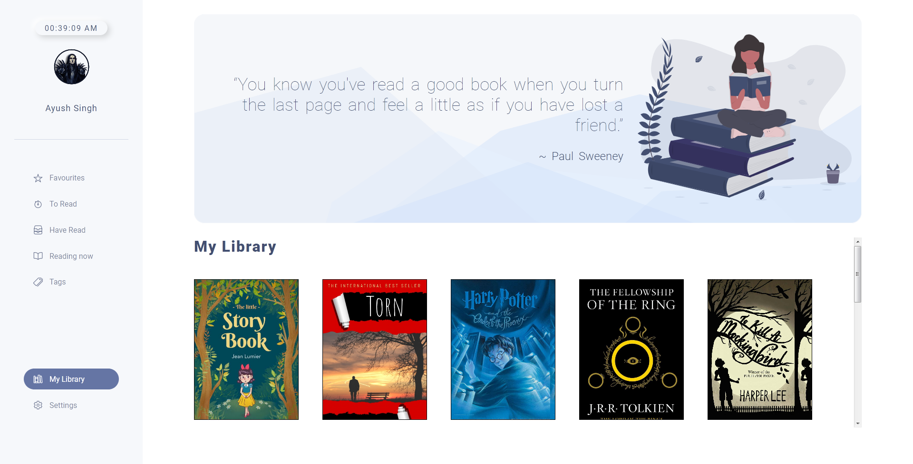
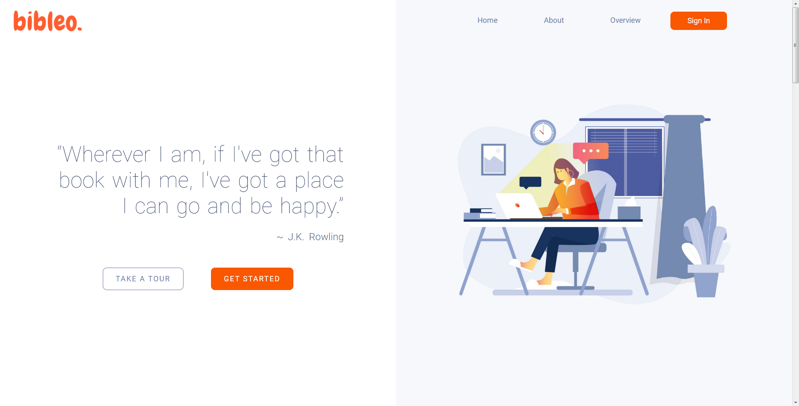
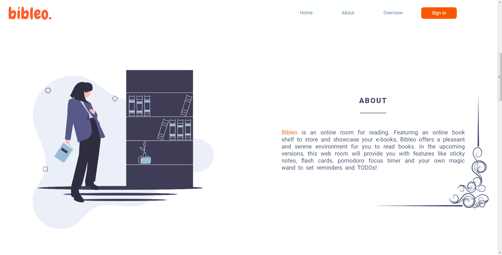
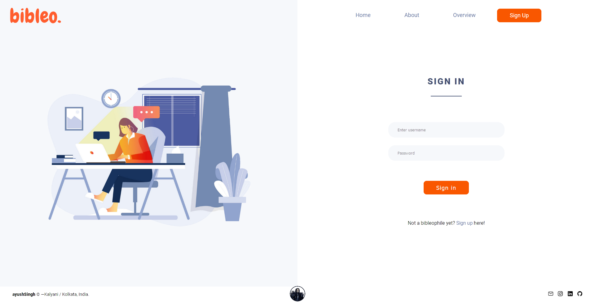

<h1 align="center">Welcome to Bibleo! 👋</h1>

A minimalist bookshelf on the web!

 

## What is this project about?

Bibleo is a platform to create and save e-book metadata, thereby creating a personal bookshelf on the web, accessible everywhere and anywhere on the go.

This project was built primarily to explore NodeJS, MongoDB and RESTful APIs.

## Project Development:
  - Backend: [Node, Express, Mongo DB]
  - Frontend: [EJS, CSS, JS]

## Usage
- Create a free mongoDB cluster and connect to the project using the connection string. - [Here's my gist on how to](https://gist.github.com/singhayushh/426f10353a8051593828e92c139ebdbc)
- Go through the [how-to-run.md](https://github.com/singhayushh/project_Bookmarks/blob/master/how-to-run.md) for details.

## Screenshots

* Dashboard

  Acknowledgement: [Vadim Drut's Shot](https://dribbble.com/shots/10980760-Book-Library-page)

* Home

* About

* Login

----------
